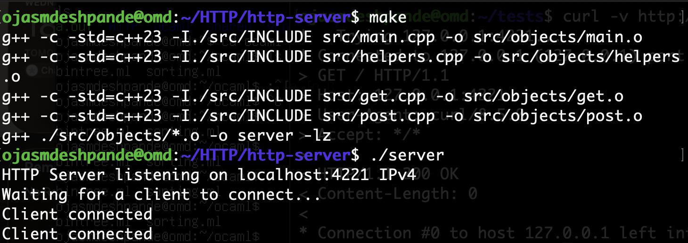
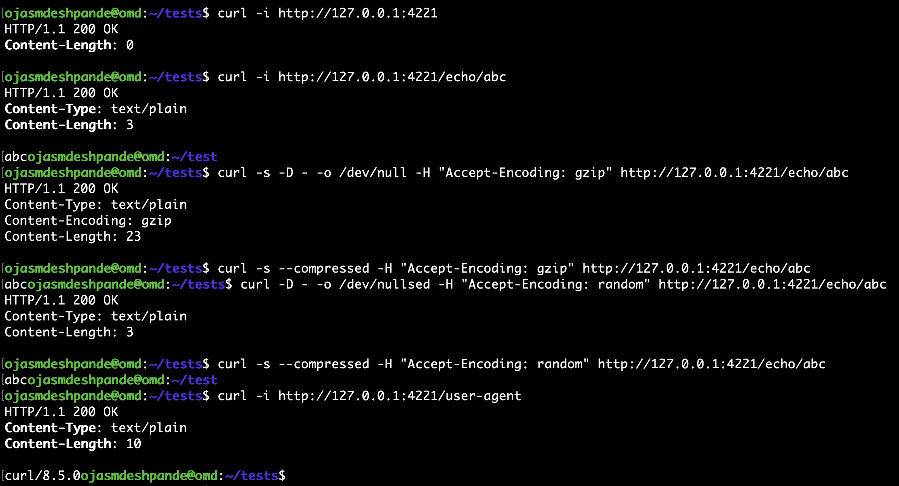

[HTTP](https://en.wikipedia.org/wiki/Hypertext_Transfer_Protocol) is the
protocol that powers the web. 

HTTP requests and endpoints supported in this project - 
1. GET
   Endpoints
   a) Empty GET request       - 200 OK response
   b) /echo/{string} endpoint - Responds with {string} in the response body
                                Also supports gzip compression in the response when header "Accept-Encoding" is provided with one of the values being gzip
                                Response header "Content-Encoding: gzip" shows the encoding.
   c) /user-agent             - Client's [User-Agent](https://developer.mozilla.org/en-US/docs/Web/HTTP/Reference/Headers/User-Agent) is returned in the response body
   d) /files/{file-name}      - File contents are returned from the given {file-name} if file exists.
                                Else a 404-Not Found Response is returned.

  
Images

  
  

   
3. POST
  Endpoint
  /files/{file-name}          - Request body is read and stored in the {file-name} file. HTTP 201 OK response returned.

Also supports multiple concurrent and persistent connections.

