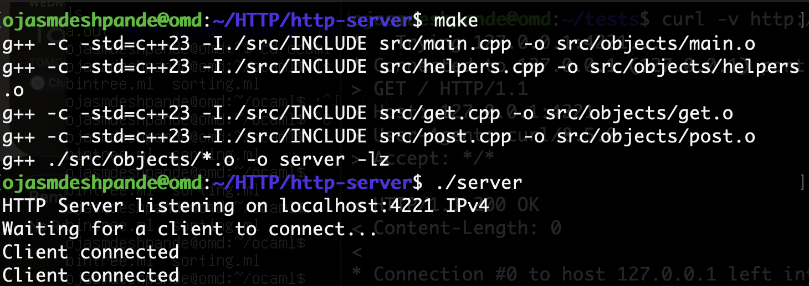
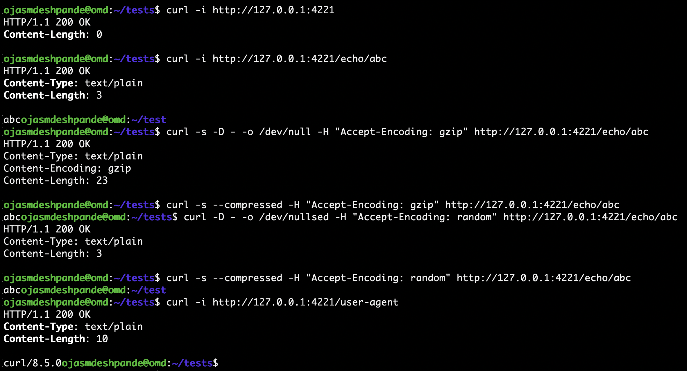

[HTTP](https://en.wikipedia.org/wiki/Hypertext_Transfer_Protocol) is the protocol that powers the web.

<b>HTTP requests and endpoints supported in this project</b> -
  

<b>1) GET</b>
 
<b>&nbsp;&nbsp;Endpoints</b>
 

&nbsp;&nbsp;a) <b>GET /</b> (empty path) &nbsp;→&nbsp; <b>200 OK</b>
 

&nbsp;&nbsp;b) <b>GET /echo/{string}</b> &nbsp;→&nbsp; Responds with <code>{string}</code> in the response body
 
&nbsp;&nbsp;&nbsp;&nbsp;Also supports <b>gzip</b> compression when request header <code>Accept-Encoding</code> contains <code>gzip</code>
 
&nbsp;&nbsp;&nbsp;&nbsp;Response includes header <code>Content-Encoding: gzip</code>
 

&nbsp;&nbsp;c) <b>GET /user-agent</b> &nbsp;→&nbsp; Returns the client’s
<a href="https://developer.mozilla.org/en-US/docs/Web/HTTP/Reference/Headers/User-Agent">User-Agent</a>
in the response body
 

&nbsp;&nbsp;d) <b>GET /files/{file-name}</b> &nbsp;→&nbsp; Returns file contents if the file exists
 
&nbsp;&nbsp;&nbsp;&nbsp;Else returns <b>404 Not Found</b>
  

  
<b>Images</b>

   
  
    
  

  

<b>2) POST</b>
 
<b>&nbsp;&nbsp;Endpoint</b>
 

&nbsp;&nbsp;<b>POST /files/{file-name}</b> &nbsp;→&nbsp; Stores the request body into <code>{file-name}</code>
 
&nbsp;&nbsp;Returns <b>201 Created</b>
  

Also supports multiple concurrent and persistent connections.

  

<b>Performance / Load Testing</b>
 
Load-tested using <a href="https://github.com/wg/wrk">wrk</a> on a local VM (HTTP/1.1, <code>-t4 -c100 -d20s --latency</code>)
  

&nbsp;&nbsp;• <b>GET /</b> &nbsp;→&nbsp; ~<b>270K req/s</b>, ~<b>0.29 ms</b> median latency
 
&nbsp;&nbsp;• <b>GET /health</b> &nbsp;→&nbsp; ~<b>260–274K req/s</b>, ~<b>0.24–0.27 ms</b> median latency
 
&nbsp;&nbsp;• <b>GET /echo/abc</b> &nbsp;→&nbsp; ~<b>255–260K req/s</b>, ~<b>0.25–0.30 ms</b> median latency
  

&nbsp;&nbsp;<i>Note:</i> At peak load the server becomes CPU-bound; tail latency/timeouts may vary under VM scheduling.
